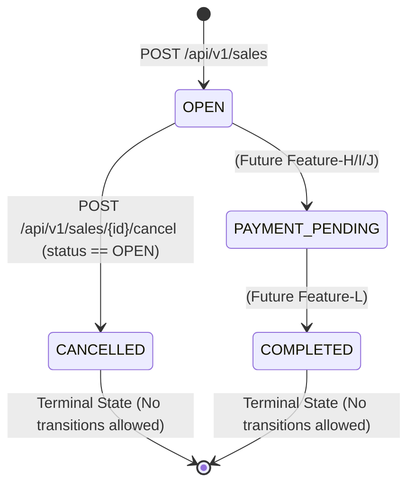

# Feature Feature-D: Sale Lifecycle Management

Status: Approved Contract

Owner: Cashier / POS Team

GitHub Issue: `[Feature-D] Sale Lifecycle Management: Start, Maintain State, and Cancel Sale`

Branch: `feature/issue-1-sale-lifecycle` (Git local branch: `feature-d-sale-lifecycle-management`)

---

## 1. Purpose and Scope

### 1.1 Outcome
Provide the foundational sale aggregate lifecycle for the Kaching POS checkout engine. This feature enables authorized cashiers to start a new sale, maintain the active `OPEN` cart state across sessions, and cancel an uncompleted sale cleanly before payment.

### 1.2 Included Scope
- **Database Architecture**: Introduce `Sale` entity in Prisma schema (`id` UUID, `saleNumber`, `status` [`OPEN`, `CANCELLED`, `COMPLETED`], optional context fields [`storeId`, `terminalId`, `cashierId`], monetary totals, `version` for optimistic concurrency, `createdAt`, `updatedAt`).
- **REST API Endpoints**:
  - `POST /api/v1/sales` - Create a new sale aggregate in `OPEN` status.
  - `GET /api/v1/sales/{id}` - Retrieve the current sale state and aggregate totals.
  - `POST /api/v1/sales/{id}/cancel` - Transition an `OPEN` sale to `CANCELLED` status with mandatory version check.
- **Client User Interface**:
  - "Start New Sale" action button.
  - Active sale header displaying formatted sale number and `OPEN` status badge.
  - "Cancel Sale" button (`status.error`) triggering a confirmation modal dialog (`docs/system/ui_spec.md`).

### 1.3 Explicit Exclusions
- Payment method selection and processing (Cash/Card payments - Features H, I, J, K).
- Cart item addition/modification (Feature E).
- Order-level discount calculations (Feature G).
- Transactional inventory outbox message generation (Features N, O).
- Offline sale creation (`NFR-012`).
- Re-opening, cancelling, or modifying a completed sale (`BR-014`).

---

## 2. Requirements Traceability

| Source ID | Requirement Summary | Design & Contract Section | Test Coverage ID |
|---|---|---|---|
| `FR-002` | Allow authorized cashier to start a new sale | Section 1.2, 3 (AC-D-01), 5.1 | `STS-D-01`, `STS-D-05` |
| `FR-006` | Allow cashier to cancel a sale at any time before completion | Section 1.2, 3 (AC-D-03), 5.3, 7.2 | `STS-D-03`, `STS-D-07` |
| `BR-015` | Cancelled sale excluded from sales totals and produces no inventory message | Section 3 (AC-D-04), 6.2 | `STS-D-04` |
| `NFR-001` | Response time under 2 seconds for 95% of requests | Section 5.1, 5.3 (API Performance) | `STS-D-01`, `STS-D-03` |
| `NFR-008` | Auditability: Record responsible user, date, time, store, terminal for cancellations | Section 7.3 (Audit Trail) | `STS-D-09` |
| `NFR-012` | Online connectivity required; offline sales not supported | Section 3 (AC-D-05), 4.2 | `STS-D-06` |
| `NFR-016` | Usability & Accessibility: WCAG 2.1 AA, keyboard focus, Escape key support | Section 4.1, 4.2, 8 | `STS-D-08`, `STS-D-10` |

---

## 3. User Workflow and Acceptance Criteria

### 3.1 Workflow Overview
1. Cashier opens POS checkout page (`/checkout`).
2. Cashier clicks **"Start New Sale"**.
3. Backend creates a new `Sale` in `OPEN` status with a unique UUID and generated `saleNumber` in format `SALE-YYYYMMDD-XXXX` (where `YYYYMMDD` is current date string and `XXXX` is a 4-digit sequence starting at 0001).
4. Checkout UI displays active sale header and initializes empty cart view.
5. If the cashier clicks **"Cancel Sale"**, a confirmation modal prompts for verification ("Cancel Sale #SALE-YYYYMMDD-XXXX?").
6. Upon confirmation, backend checks that the sale status is strictly `OPEN` and updates status to `CANCELLED`.
7. UI disables further cart actions and displays sale cancellation summary.

### 3.2 Acceptance Criteria
- **AC-D-01 (Start New Sale)**: GIVEN an active cashier session, WHEN the cashier clicks "Start New Sale", THEN backend creates a new `Sale` record with status `OPEN`, initial subtotal/discount/VAT/total of `"0.00"`, `version = 1`, and returns `201 Created` with the full sale object within 2,000 ms (`FR-002`, `NFR-001`).
- **AC-D-02 (Maintain Sale State)**: GIVEN an active `OPEN` sale ID, WHEN `GET /api/v1/sales/{id}` is called or page refreshes, THEN system returns current sale state without mutating state.
- **AC-D-03 (Cancel Sale)**: GIVEN an `OPEN` sale, WHEN the cashier clicks "Cancel Sale" and confirms in the confirmation dialog, THEN status transitions to `CANCELLED`, `updatedAt` is refreshed, and no further item or discount edits are allowed (`FR-006`).
- **AC-D-04 (Cancelled Sale Exclusion)**: GIVEN a `CANCELLED` sale, THEN backend reporting queries exclude it from daily sales totals, and no pending inventory outbox record is created (`BR-015`).
- **AC-D-05 (Offline Safeguard)**: GIVEN the client loses network connectivity to Kaching API, THEN "Start New Sale" and "Cancel Sale" actions are disabled, displaying a persistent offline banner (`NFR-012`).

---

## 4. UI Specification

### 4.1 Visual Components
- **`SaleHeader`**: Displays active `saleNumber`, status badge (`OPEN` in `brand.orange` / `surface.subtle`, `CANCELLED` in `status.error`), and timestamp.
- **`StartSaleButton`**: Primary button (`action.primary` `#B33100`, white text, $\ge 44 \times 44$ px) with label "Start New Sale".
- **`CancelSaleButton`**: Destructive action button (`status.error` `#B42318`, $\ge 44 \times 44$ px) with label "Cancel Sale".
- **`CancelSaleModal`**: Confirmation dialog trapping focus (`FocusTrap`), displaying sale number, initial focus on safe button ("Keep Sale"), support for `Escape` key cancellation, and restoring focus to `CancelSaleButton` upon close (`docs/system/ui_spec.md`).

### 4.2 Screen States

| State | UI Display | Available Actions |
|---|---|---|
| **Idle / No Active Sale** | Empty checkout workspace, "No active sale" banner | "Start New Sale" button enabled |
| **Sale OPEN** | Active sale header (`saleNumber`, `OPEN` badge), empty cart notice | "Cancel Sale" button enabled |
| **Cancelling (Loading)** | Button text "Cancelling...", disabled inputs, spinner | All actions disabled (`aria-live="polite"`) |
| **Sale CANCELLED** | Header badge `CANCELLED`, cancellation notice banner | "Start New Sale" button enabled, cart locked |
| **API Disconnected** | Persistent top warning banner ("API Offline") | All sale lifecycle buttons disabled |

---

## 5. API Specification

### 5.1 Create Sale (`POST /api/v1/sales`)

- **Method / Path**: `POST /api/v1/sales`
- **Headers**: `Content-Type: application/json`
- **Request Body**:
  ```json
  {}
  ```
- **Success Response (`201 Created`)** (Response time $\le 2,000\text{ ms}$):
  ```json
  {
    "id": "a0eebc99-9c0b-4ef8-bb6d-6bb9bd380a11",
    "saleNumber": "SALE-20260827-0001",
    "status": "OPEN",
    "storeId": null,
    "terminalId": null,
    "cashierId": null,
    "subtotal": "0.00",
    "discountAmount": "0.00",
    "vatAmount": "0.00",
    "totalAmount": "0.00",
    "version": 1,
    "createdAt": "2026-08-27T10:15:00.000Z",
    "updatedAt": "2026-08-27T10:15:00.000Z"
  }
  ```
- **Error Response (`500 Internal Server Error`)**:
  ```json
  {
    "code": "SALE_CREATION_FAILED",
    "title": "Unable to start sale",
    "message": "Failed to create a new sale. Please try again.",
    "retryable": true
  }
  ```

### 5.2 Get Sale (`GET /api/v1/sales/{id}`)

- **Method / Path**: `GET /api/v1/sales/{id}`
- **Success Response (`200 OK`)**: Same schema as 5.1.
- **Error Response (`404 Not Found`)**:
  ```json
  {
    "code": "SALE_NOT_FOUND",
    "title": "Sale Not Found",
    "message": "No sale exists with ID 'a0eebc99-9c0b-4ef8-bb6d-6bb9bd380a11'.",
    "retryable": false
  }
  ```

### 5.3 Cancel Sale (`POST /api/v1/sales/{id}/cancel`)

- **Method / Path**: `POST /api/v1/sales/{id}/cancel`
- **Headers**: `Content-Type: application/json`
- **Request Body** (Required):
  ```json
  {
    "version": 1
  }
  ```
- **Success Response (`200 OK`)** (Response time $\le 2,000\text{ ms}$):
  ```json
  {
    "id": "a0eebc99-9c0b-4ef8-bb6d-6bb9bd380a11",
    "saleNumber": "SALE-20260827-0001",
    "status": "CANCELLED",
    "storeId": null,
    "terminalId": null,
    "cashierId": null,
    "subtotal": "0.00",
    "discountAmount": "0.00",
    "vatAmount": "0.00",
    "totalAmount": "0.00",
    "version": 2,
    "createdAt": "2026-08-27T10:15:00.000Z",
    "updatedAt": "2026-08-27T10:16:30.000Z"
  }
  ```
- **Error Response - Missing Body Version (`400 Bad Request`)**:
  ```json
  {
    "code": "MISSING_VERSION_FIELD",
    "title": "Invalid Request Payload",
    "message": "The 'version' field is required for cancelling a sale.",
    "retryable": false
  }
  ```
- **Error Response - Stale Version (`409 Conflict`)**:
  ```json
  {
    "code": "SALE_VERSION_CONFLICT",
    "title": "Sale State Conflict",
    "message": "The sale has been modified by another process. Please refresh and try again.",
    "retryable": true
  }
  ```
- **Error Response - Invalid State (`400 Bad Request`)**:
  *(Triggered when `status` is NOT `OPEN`, e.g. if sale is `CANCELLED`, `COMPLETED`, `PAYMENT_PENDING`, or `PAYMENT_RECOVERY_PENDING` per FR-016 & SDS 7.3)*
  ```json
  {
    "code": "INVALID_SALE_STATE",
    "title": "Cannot Cancel Sale",
    "message": "Sale cannot be cancelled because its current status is 'CANCELLED'. Only 'OPEN' sales may be cancelled.",
    "retryable": false
  }
  ```

---

## 6. Data and Transaction Design

### 6.1 Prisma Schema Definition

```prisma
enum SaleStatus {
  OPEN
  PAYMENT_PENDING
  PAYMENT_RECOVERY_PENDING
  COMPLETED
  CANCELLED
}

model Sale {
  id             String     @id @default(uuid()) @db.Uuid
  saleNumber     String     @unique
  status         SaleStatus @default(OPEN)
  storeId        String?
  terminalId     String?
  cashierId      String?
  subtotal       Decimal    @default(0.00) @db.Decimal(12, 2)
  discountAmount Decimal    @default(0.00) @db.Decimal(12, 2)
  vatAmount      Decimal    @default(0.00) @db.Decimal(12, 2)
  totalAmount    Decimal    @default(0.00) @db.Decimal(12, 2)
  version        Int        @default(1)
  createdAt      DateTime   @default(now())
  updatedAt      DateTime   @updatedAt

  @@index([status, createdAt])
}
```

### 6.2 State Transition Matrix



- **Valid Transition**: `OPEN` $\rightarrow$ `CANCELLED`.
- **Forbidden Transitions**:
  - `CANCELLED` $\rightarrow$ Any (Reject with HTTP 400 `INVALID_SALE_STATE`)
  - `COMPLETED` $\rightarrow$ Any (Reject with HTTP 400 `INVALID_SALE_STATE`)
  - `PAYMENT_PENDING` / `PAYMENT_RECOVERY_PENDING` $\rightarrow$ `CANCELLED` (Reject with HTTP 400 `INVALID_SALE_STATE` per `FR-016`)

---

## 7. Security and Operational Behavior

### 7.1 Security & Access Control
- API endpoints require an active authenticated user session.
- Client never stores sensitive tokens or credentials in source control (`AGENTS.md`).

### 7.2 Safe API Error Handling
- Internal PostgreSQL or Prisma exceptions (e.g. unique key constraint violation) are caught and converted into standard Problem Details responses (`AGENTS.md`).
- Stack traces and internal database schemas are never returned to client responses.

### 7.3 Audit Trail Behavior (`NFR-008`, SDS Section 9.4)
- Upon successful cancellation (`POST /api/v1/sales/{id}/cancel`), server logs structured JSON audit entry containing all mandatory audit fields:
  ```json
  {
    "event": "SALE_CANCELLED",
    "saleId": "a0eebc99-9c0b-4ef8-bb6d-6bb9bd380a11",
    "saleNumber": "SALE-20260827-0001",
    "actor": "user-cashier-01",
    "role": "Cashier",
    "storeId": "store-01",
    "terminalId": "term-01",
    "correlationId": "req-12345",
    "outcome": "SUCCESS",
    "timestamp": "2026-08-27T10:16:30.000Z"
  }
  ```

---

## 8. Software Test Specification (STS)

| Test ID | Level | Preconditions | Action | Expected Result | Requirement |
|---|---|---|---|---|---|
| `STS-D-01` | Integration (API) | Server running, DB migrated | `POST /api/v1/sales` | HTTP 201 Created in $\le 2,000\text{ ms}$, returns `status: "OPEN"`, `version: 1`, valid UUID and `saleNumber`, money fields `"0.00"`. | `FR-002`, `NFR-001` |
| `STS-D-02` | Integration (API) | Sale `a0eebc99-...` exists | `GET /api/v1/sales/a0eebc99-...` | HTTP 200 OK, returns sale payload without state mutation. | `FR-002` |
| `STS-D-03` | Integration (API) | Sale exists with `status: "OPEN"`, `version: 1` | `POST /api/v1/sales/{id}/cancel` with `{ "version": 1 }` | HTTP 200 OK in $\le 2,000\text{ ms}$, `status: "CANCELLED"`, `version: 2`. | `FR-006`, `NFR-001` |
| `STS-D-04` | Integration (API) | Sale exists with `status: "CANCELLED"` | `POST /api/v1/sales/{id}/cancel` with `{ "version": 2 }` | HTTP 400 Bad Request (`INVALID_SALE_STATE`), sale remains `CANCELLED`. | `BR-015` |
| `STS-D-05` | Unit (Server) | Prisma mock ready | Call `createSale()` service | Returns new sale model instance with default Decimal values. | `FR-002` |
| `STS-D-06` | Unit (Server) | Sale version in DB is 2 | Call `cancelSale(id, version=1)` | Throws `SaleVersionConflictError` $\rightarrow$ HTTP 409 Conflict. | `NFR-001` |
| `STS-D-07` | Client (React) | Render `App` component | Click "Start New Sale" button | Button shows loading state, then active sale header displays `saleNumber` and `OPEN` badge. | `FR-002` |
| `STS-D-08` | Client (React) | Active `OPEN` sale rendered | Click "Cancel Sale" $\rightarrow$ confirm in modal | Modal opens with focus trap, confirmation triggers API call, UI updates to `CANCELLED` badge. | `FR-006`, `NFR-016` |
| `STS-D-09` | Client (React) | Mock API failure / offline | Click "Start New Sale" | Offline alert banner displays, buttons disabled. | `NFR-012` |
| `STS-D-10` | Client (React) | `CancelSaleModal` is open | Press `Escape` key | Modal closes without sending cancel request, focus restores to `CancelSaleButton`. | `NFR-016` |

---

## 9. Open Decisions

All design and technical decisions for Feature-D have been resolved:
- **Prisma Entity Schema**: `Sale` model with status enum `SaleStatus` and optional context fields (`storeId`, `terminalId`, `cashierId`) approved.
- **REST API Contracts**: `POST /sales`, `GET /sales/{id}`, `POST /sales/{id}/cancel` with decimal string representation and mandatory payload `version` approved.
- **State Machine & Safety**: `OPEN` $\rightarrow$ `CANCELLED` transition approved; cancellation strictly blocked for all non-OPEN states.
- **Audit Logging**: Full audit fields (`actor`, `role`, `storeId`, `terminalId`, `correlationId`, `outcome`) approved per `NFR-008`.
