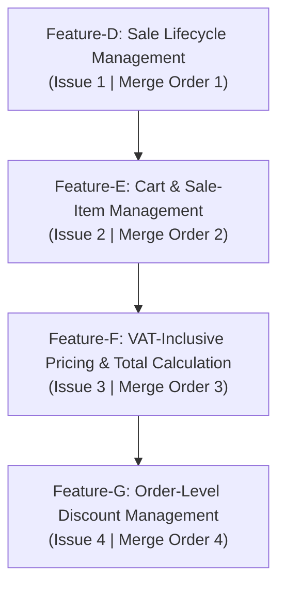

# POS Lab 2 POC Scope, Feature Breakdown, and Implementation Issues

Status: Baselined for POS Lab 2 (Features D, E, F, G)

This document defines the exact scope, exclusions, requirement IDs, acceptance criteria, dependencies, branch names, and merge order for the four POS Lab 2 features.

---

## Merge Order & Feature Overview

| Issue ID | Feature | Issue Title | Branch Name | Merge Order | Dependency |
|---|---|---|---|:---:|---|
| **Issue 1** | **Feature-D** | `[Feature-D] Sale Lifecycle Management: Start, Maintain State, and Cancel Sale` | `feature/issue-1-sale-lifecycle` | 1 | None (base on `lab2-staging`) |
| **Issue 2** | **Feature-E** | `[Feature-E] Cart and Sale-Item Management: Barcode Scan, Manual Entry, Quantity Change, and Item Removal` | `feature/issue-2-cart-management` | 2 | Issue 1 (`feature/issue-1-sale-lifecycle`) |
| **Issue 3** | **Feature-F** | `[Feature-F] VAT-Inclusive Pricing and Total Calculation: Subtotal, VAT Calculation, and Final Amount` | `feature/issue-3-vat-total-calculation` | 3 | Issue 2 (`feature/issue-2-cart-management`) |
| **Issue 4** | **Feature-G** | `[Feature-G] Order-Level Discount Management: Percentage and Amount Entry, Validation, and Recalculation` | `feature/issue-4-order-discount` | 4 | Issue 3 (`feature/issue-3-vat-total-calculation`) |

---

## Detailed Feature Specifications

### 1. Feature-D: Sale Lifecycle Management

* **Exact Issue Title**: `[Feature-D] Sale Lifecycle Management: Start, Maintain State, and Cancel Sale`
* **Branch Name**: `feature/issue-1-sale-lifecycle`
* **Merge Order**: 1
* **Dependency**: None (builds on POS Lab 1 baseline and branches from `lab2-staging`)
* **Requirement IDs**: `FR-002`, `FR-006`, `BR-015`, `NFR-001`, `NFR-012`
* **Scope**:
  * **Database**: Introduce `Sale` entity in Prisma schema (`id` UUID, `saleNumber`, `status` [`OPEN`, `CANCELLED`, `COMPLETED`], `subtotal`, `discountAmount`, `vatAmount`, `totalAmount`, `createdAt`, `updatedAt`).
  * **API Endpoints**:
    * `POST /api/v1/sales` - Start a new sale (returns new `OPEN` sale object).
    * `GET /api/v1/sales/{id}` - Fetch active sale state and items.
    * `POST /api/v1/sales/{id}/cancel` - Cancel an open sale.
  * **Frontend UI**: "Start New Sale" button, sale header displaying active sale number and state (`OPEN`), "Cancel Sale" button with confirmation modal.
* **Exclusions**:
  * Payment processing (Cash/Card payment - Features H, I, J, K).
  * Transactional outbox publishing (Feature N, O).
  * Offline sale creation (`NFR-012`).
  * Sale modification after completion.
* **Acceptance Criteria**:
  1. **GIVEN** an active cashier session, **WHEN** clicking "Start New Sale", **THEN** an `OPEN` sale is created with unique UUID and timestamp, and displayed on the checkout interface (`FR-002`).
  2. **GIVEN** an `OPEN` sale, **WHEN** the cashier clicks "Cancel Sale" and confirms in the dialog, **THEN** the sale status changes to `CANCELLED` and no further item additions or edits are allowed (`FR-006`).
  3. **GIVEN** a `CANCELLED` sale, **THEN** it is excluded from sales totals and produces no inventory outbox message (`BR-015`).
  4. **GIVEN** backend API is unreachable, **THEN** starting or cancelling a sale is disabled (`NFR-012`).

---

### 2. Feature-E: Cart and Sale-Item Management

* **Exact Issue Title**: `[Feature-E] Cart and Sale-Item Management: Barcode Scan, Manual Entry, Quantity Change, and Item Removal`
* **Branch Name**: `feature/issue-2-cart-management`
* **Merge Order**: 2
* **Dependency**: Issue 1 / Feature-D (`feature/issue-1-sale-lifecycle`)
* **Requirement IDs**: `FR-003`, `FR-043`, `BR-002`, `BR-016`, `NFR-001`
* **Scope**:
  * **Database**: Introduce `SaleItem` entity in Prisma schema (`id` UUID, `saleId`, `productId`, `codeSnapshot`, `nameSnapshot`, `unitPriceSnapshot`, `quantity`, `extendedAmount`).
  * **API Endpoints**:
    * `POST /api/v1/sales/{id}/items` - Add item by barcode or product ID.
    * `PATCH /api/v1/sales/{id}/items/{itemId}` - Update item quantity.
    * `DELETE /api/v1/sales/{id}/items/{itemId}` - Remove item from cart.
  * **Frontend UI**:
    * Auto-focused barcode input supporting USB keyboard-wedge barcode scanners and manual barcode typing (`FR-043`).
    * Product search modal/dropdown searching by product code or name (`FR-043`).
    * Cart table displaying code, product name, unit price, quantity controls (+ / - buttons / inline edit), line total, and remove button (`FR-003`).
* **Exclusions**:
  * Item-level or line-item discounts (`BR-003`).
  * Synchronous inventory availability checking at checkout (`BR-016`).
* **Acceptance Criteria**:
  1. **GIVEN** an `OPEN` sale, **WHEN** a valid product barcode is scanned or entered, **THEN** the product is added to the cart, capturing a snapshot of unit price and code (`FR-003`, `FR-043`).
  2. **GIVEN** a product added multiple times, **WHEN** scanned again, **THEN** the item quantity increments and extended amount updates (`BR-002`).
  3. **GIVEN** an item in cart, **WHEN** quantity is modified or item is removed, **THEN** line total and cart subtotal update immediately (`FR-003`, `BR-002`).
  4. **GIVEN** product search, **WHEN** typing partial code or name, **THEN** matching active products are listed for selection (`FR-043`).
  5. **GIVEN** physical presence of an item at counter, **THEN** POS allows sale without blocking on recorded stock level (`BR-016`).

---

### 3. Feature-F: VAT-Inclusive Pricing and Total Calculation

* **Exact Issue Title**: `[Feature-F] VAT-Inclusive Pricing and Total Calculation: Subtotal, VAT Calculation, and Final Amount`
* **Branch Name**: `feature/issue-3-vat-total-calculation`
* **Merge Order**: 3
* **Dependency**: Issue 2 / Feature-E (`feature/issue-2-cart-management`)
* **Requirement IDs**: `FR-004`, `BR-001`, `BR-002`, `BR-005`, `BR-010`, `NFR-001`, `NFR-010`
* **Scope**:
  * **Backend Domain Service**:
    * Decimal calculation module (`Prisma.Decimal`) for subtotal, 7% VAT portion extraction from VAT-inclusive price ($\text{VAT} = \text{Total} \times \frac{7}{107}$), and final amount ($\text{Final} = \text{Subtotal} - \text{Discount}`).
    * Commercial satang rounding (half-up to 2 decimal places) (`BR-005`).
  * **Frontend UI**:
    * Right-region summary panel continuously displaying Subtotal, Discount, VAT Amount (7% included), and Final Sale Amount (`FR-004`).
    * All monetary numbers formatted using THB currency and tabular numerals (`NFR-010`).
* **Exclusions**:
  * Full Tax Invoice printing (Abbreviated receipt only).
  * Multi-currency conversion (Thai Baht THB only).
* **Acceptance Criteria**:
  1. **GIVEN** items in cart, **WHEN** items or quantities change, **THEN** Subtotal, VAT portion, and Final Sale Amount update continuously (`FR-004`).
  2. **GIVEN** product prices in THB including VAT (`BR-001`), **THEN** Subtotal equals the exact sum of extended amounts before discount (`BR-002`).
  3. **GIVEN** monetary calculations, **THEN** percentage-based amounts are rounded to the nearest satang (`BR-005`) and serialized as 2-decimal strings (`NFR-010`).
  4. **GIVEN** Subtotal and Discount Amount, **THEN** Final Sale Amount equals Subtotal minus Discount Amount (`BR-010`).

---

### 4. Feature-G: Order-Level Discount Management

* **Exact Issue Title**: `[Feature-G] Order-Level Discount Management: Percentage and Amount Entry, Validation, and Recalculation`
* **Branch Name**: `feature/issue-4-order-discount`
* **Merge Order**: 4
* **Dependency**: Issue 3 / Feature-F (`feature/issue-3-vat-total-calculation`)
* **Requirement IDs**: `FR-004`, `FR-005`, `BR-003`, `BR-004`, `BR-005`, `BR-006`, `BR-007`, `BR-008`, `BR-009`, `BR-010`, `NFR-001`, `NFR-008`
* **Scope**:
  * **API Endpoints**:
    * `POST /api/v1/sales/{id}/discount` - Set discount percentage or discount amount.
  * **Backend Domain Logic**:
    * Enforce maximum of ONE order-level discount per sale (`BR-003`).
    * Percentage-to-amount calculation: $\text{Discount Amount} = \text{RoundToSatang}\left(\frac{\text{Subtotal} \times \text{Discount Percentage}}{100}\right)$ (`BR-004`, `BR-005`).
    * Direct Discount Amount entry sets Discount Percentage to `null` (`BR-006`).
    * Automatic recalculation of Discount Amount when cart contents change while Discount Percentage is active (`BR-007`).
    * Validation: Discount Percentage must be between 0 and 100 inclusive (`BR-008`); Discount Amount must be $\ge 0$ and $\le \text{Subtotal}$ (`BR-009`).
  * **Frontend UI**:
    * Order-level discount form with Discount Percentage input (%) and Discount Amount input (THB) (`FR-005`).
    * Clear validation error messages for out-of-range inputs (`BR-008`, `BR-009`).
* **Exclusions**:
  * Product-line or item-level discounts (`BR-003`).
  * Multiple combined or stacked discounts (`BR-003`).
* **Acceptance Criteria**:
  1. **GIVEN** an `OPEN` sale, **WHEN** cashier enters Discount Percentage (0–100%), **THEN** Discount Amount is calculated as $\text{Subtotal} \times \frac{\%}{100}$ rounded to satang (`BR-004`, `BR-005`).
  2. **GIVEN** an active Discount Percentage, **WHEN** cart items or quantities change, **THEN** Discount Amount is automatically recalculated using the revised Subtotal (`BR-007`).
  3. **GIVEN** cashier enters Discount Amount directly, **THEN** Discount Percentage is set to `null` and entered amount is applied (`BR-006`).
  4. **GIVEN** invalid inputs (% < 0 or > 100, or amount < 0 or > Subtotal), **THEN** system rejects request with validation error message (`BR-008`, `BR-009`).
  5. **GIVEN** any discount applied, **THEN** audit trail logs responsible cashier, date, time, store, and terminal (`NFR-008`).
